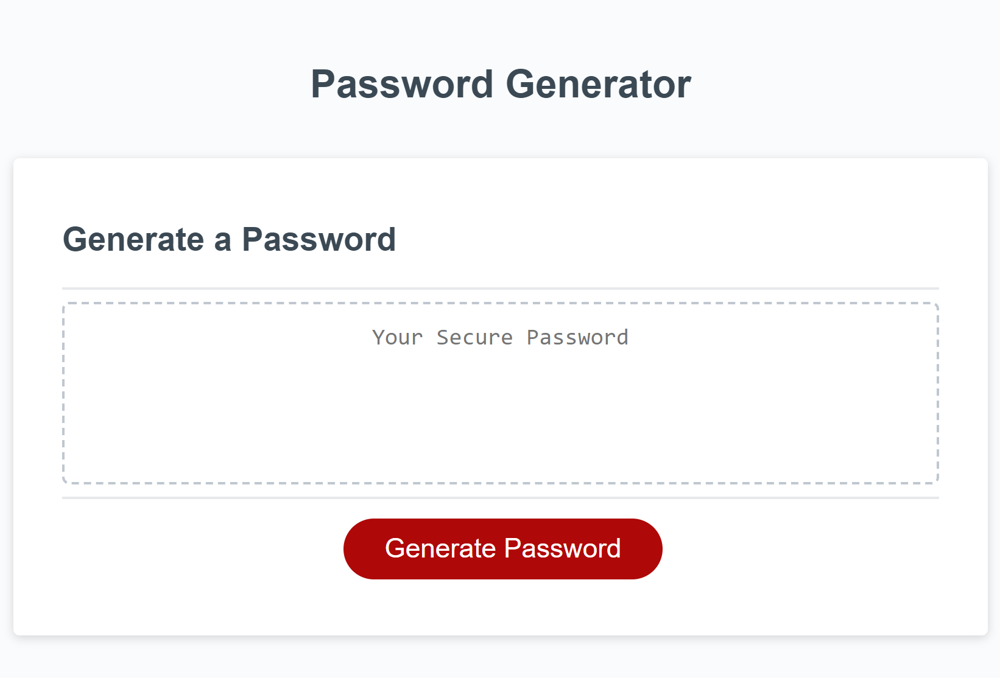

# Module-3-Challenge-Password-Generator
## Password Generator

The purpose of this project is to create a password generator application using JavaScript. The application enables employees to generate random passwords based on criteria that they've selected. This password would then be displayed using dynamically updated HTML and CSS powered by JavaScript. The following steps were followed:
- Starter JavaScript code was modified
- Program asks user to select password criteria through prompts, confirms and alerts. Password criteria includes password length, and whether to include special characters, numeric characters, lowercase characters and uppercase characters
- Based on user's selections, a password with the corresponding characters is randomly generated
- The password is then displayed in a text box by dynamically updating the HTML with an event listener

Note: There is a single line of code on line 94 of "script.js" that is used to randomly shuffle objects in the array "possibleCharactersArray". I did not author this code and it was taken directly from the following website (source: https://dev.to/codebubb/how-to-shuffle-an-array-in-javascript-2ikj). A comment indicating it's source was made directly on line 93 of "script.js".

## Password Generator Application

## Deployment
See it live at: https://alexlenson.github.io/Module-3-Challenge-Password-Generator/

